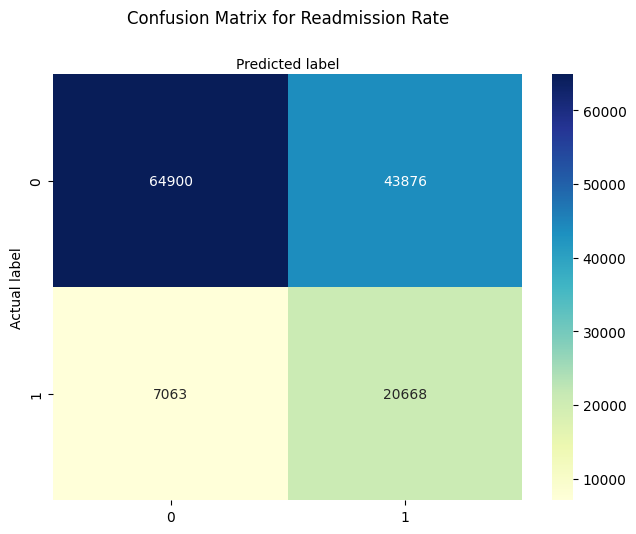
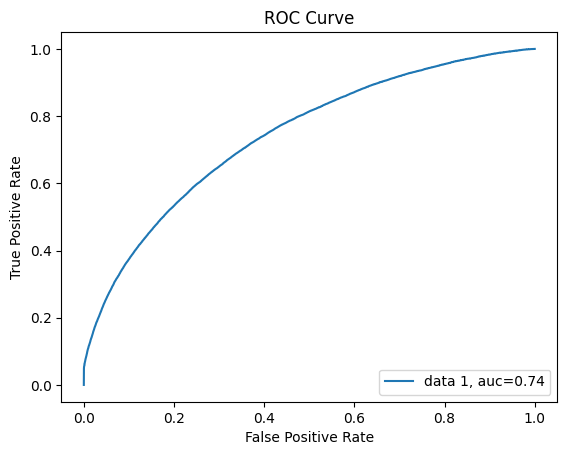

# Patient Readmission Prediction
## Project Overview
This project aims to explore the clinical, patient and administrative factors that contribute to patient readmissions in hospitals and to build a predictive model using logistic regression. The primary goal is to identify patients at high risk of readmission within 30 days of discharge, enabling earlier intervention and better healthcare resource management.
Predicting readmissions is crucial for improving patient outcomes, optimising hospital workflow, and reducing unnecessary healthcare costs associated with avoidable readmissions.
---
## Dataset Description
The project uses the MIMIC-IV (Medical Information Mart for Intensive Care IV) dataset, a large and publicly available healthcare database which contains data for over 65,000 patients admitted to an ICU and over 200,000 patients admitted to the emergency department or an intensive care unit at the Beth Deaconess Medical Centre in Boston, MA.

https://physionet.org/content/mimiciv/3.1/

Key tables used include:
- `admissions`: patient admission records
- `patients`: demographics
- `diagnoses_icd` and `d_icd_diagnoses`: diagnostic codes and labels
- `procedures_icd` and `d_icd_procedures`: procedural codes and labels
- `emar`: electronic medication records
These were joined and cleaned to produce a comprehensive dataset including demographics, diagnoses, procedures, and medication history for predictive modelling.
---
## Data Pre-Processing
- **Basic Exploration:**
  - NA's and blanks were filled accordingly
- **Diagnosis & Procedures:**
  - Text labels were highly variable hence were cleaned and grouped by label and kept only the top 200 most frequent terms.
  - Remaining terms which were not as common were grouped as other diagnosis and other procedures respectively.
- **Readmission Definition:**
  - Readmission was defined as any hospital admission that occurred within **30 days** of a patient’s previous discharge.
- **Categorical Encoding:**
  - One-hot encoding was applied to structured categorical features:
    - Admission type, admission location, discharge location, insurance, marital status, race, gender.
- **Medication Data:**
  - Cleaned and categorized as:
    - `"administered"`, `"not administered"`, `"delayed"` and `"others"`
  - Retained only `"administered"` medications, as they most directly influence outcomes.
  - Top 200 medications retained by frequency; others grouped under `"other_medications"`.
  - MultiLabelBinarizer was used for:
    - Diagnosis labels
    - Procedure labels
    - Medication labels
- Final dataset was built by joining diagnosis, procedure, and medication encodings as well as all of the patient features and admission details which were encoded.
---
## Modeling Approach
- **Model Used:** Logistic Regression  
- **Penalty:** L1 regularization (`penalty='l1'`)
- **Solver:** `liblinear` (supports L1 and small datasets efficiently)
- **Class Imbalance Strategy:**  
  - Tuned `class_weight` using `GridSearchCV` with cross-validation (3-fold)
  - Best-performing class weights: `{0:1, 1:5}` 
- **Train-Test Split:** 75% training / 25% test
---
## Model Factors
The model includes the following factor groups:
- Patient demographics (age, gender, race, insurance, marital status)
- Admission details (type, location)
- Top 200 diagnosis categories (one-hot encoded)
- Top 200 procedure categories (one-hot encoded)
- Top 200 administered medications (one-hot encoded)

### Model Performance

| Class            | Precision | Recall | F1-Score |
|------------------|-----------|--------|----------|
| Not Readmitted   | 0.90      | 0.60   | 0.72     |
| Readmitted       | 0.32      | 0.75   | 0.45     |

**ROC-AUC:** 0.74
- The model favors **recall for readmitted patients** — correctly identifying a high percentage of actual readmissions, which is beneficial in a clinical setting where missing a readmission is more costly than a false positive.
- Odds ratio plots in /plots folder
---
## Limitations
- **Class imbalance** still poses challenges; despite weighting, the model precision for readmissions remains relatively low.
- **Initial Features** only a handful of patient features were available, ideally more would be beneficial to train the model.
- **Feature selection** was limited to top 200 values per category — may miss out useful rare features.
- **No temporal modeling** — medication timing or dosage amount were not used.
- **Model simplicity** — logistic regression is interpretable but may underperform compared to tree-based models on complex data.

---

